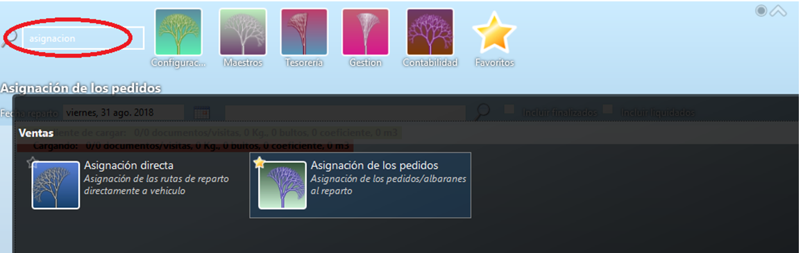
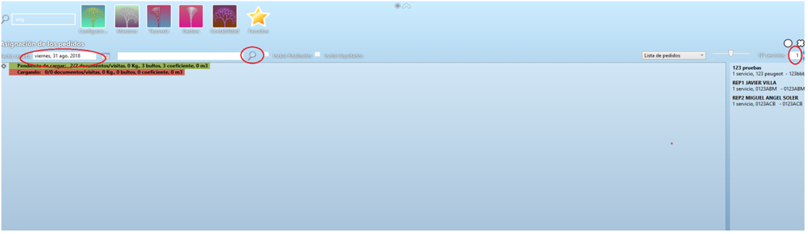
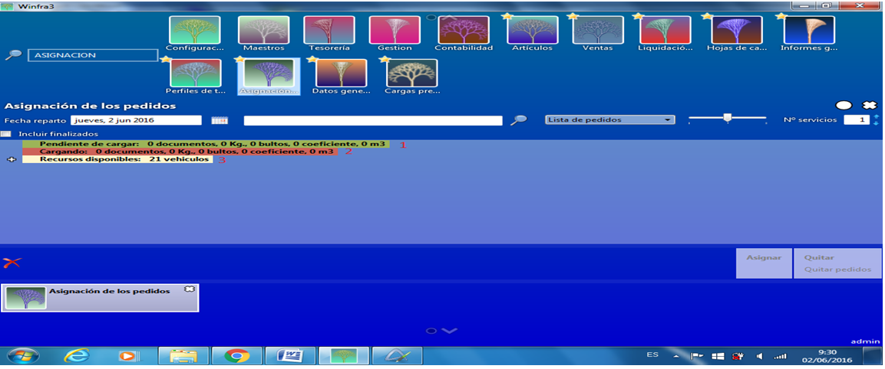
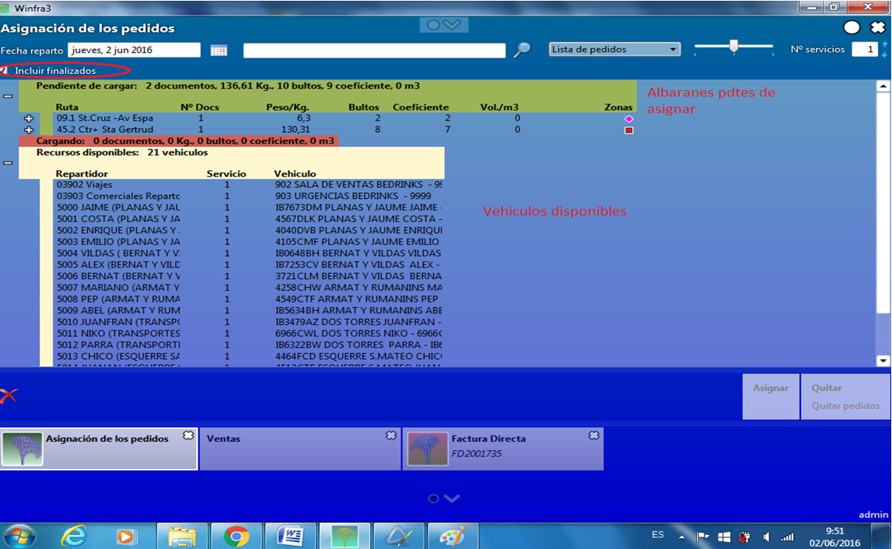
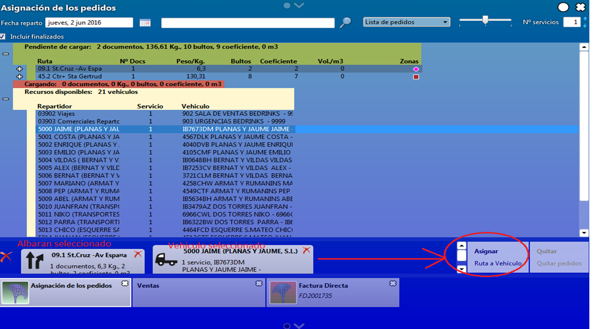
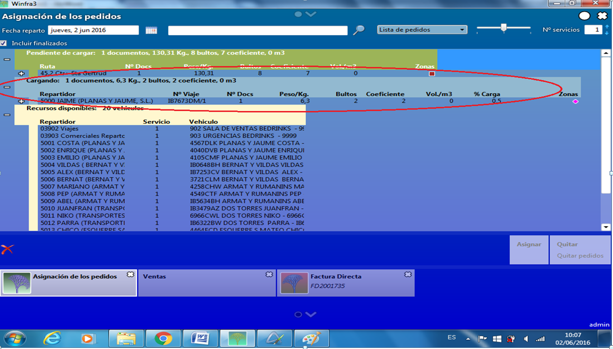
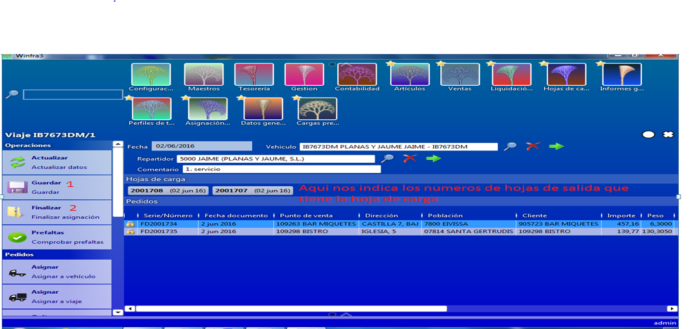
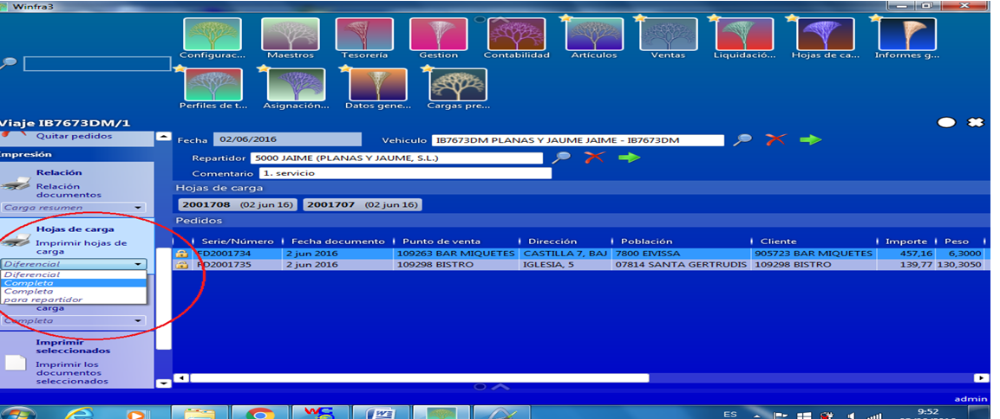
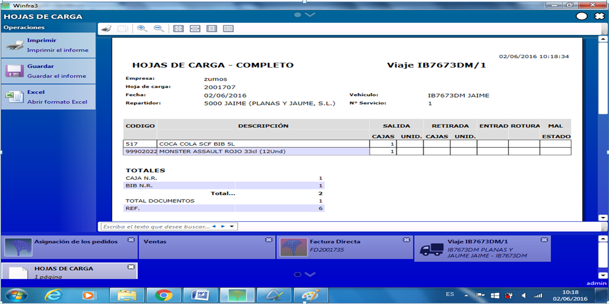
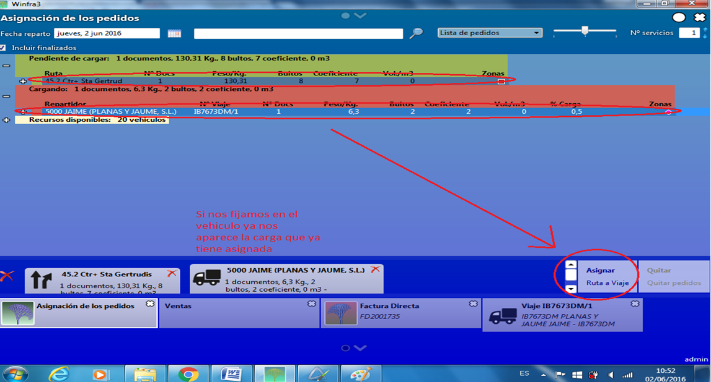

# ASIGNACION DE PEDIDOS

Para asignar un pedido, vamos al maestro y en el buscador ponemos asignación. 

Esto nos llevara a la siguiente pantalla, donde introduciremos la fecha de reparto y le daremos a la lupa del siguiente campo para que nos actualice toda la información:

En la parte central de la pantalla tenemos tres líneas  que  al presionar + nos indican en  la primera de ellas los albaranes que tenemos pendientes de asignar, la segunda nos indica los que ya tenemos asignados y la tercera los vehículos disponibles.

Nota: Si en el número de servicios (margen superior derecho) le ponemos un 2 nos daría la opción de montar un segundo viaje para un vehículo al que ya tenemos otro viaje asignado. Es decir, nos permite realizar varias asignaciones de viajes para un mismo vehículo al mismo tiempo.

Si tuviésemos algún camión que ya hemos utilizado pero sabemos que puede llevar más pedidos, deberemos clicar la opción de Incluir finalizados para que nos los muestre también, este nos aparecería en la segunda línea, esta opción dependiendo de la pantalla del ordenador nos puede aparecer al lado de la lupa del campo de búsqueda central superior: 

Primero seleccionaríamos los albaranes clicando sobre ellos y 
Seguidamente seleccionaríamos el vehículo al que los queremos asignar, en la parte inferior de la pantalla nos aparecerán los albaranes y el vehículo al que los vamos a asignar en la parte izquierda y en la parte inferior derecha nos aparece un cuadro que pone Asignar Ruta a Vehículos que es el que clicaremos una vez tengamos seleccionados todos los albaranes que irán en esa ruta:

Una vez hemos clicado en Asignar veremos que en la segunda línea nos aparece el número de documentos que estamos preparando y la cantidad de bultos que son para que podamos calcular el completar un vehículo:

Una vez completado el vehículo, procederemos a cerrar la asignación, lo primero clicaremos sobre el vehículo con doble clic y nos llevara al detalle del viaje de ese vehículo, donde veremos más detallado todos los albaranes asignados a ese viaje  y entonces procederemos a Guardar y Finalizar la asignación:

Después imprimiremos la hoja de carga, hay que seleccionar la opción de que se nos imprima Completa para el repartidor la primera vez, si tuviéramos que incluir mas albaranes en vez de Completa seleccionaríamos la opción de Diferencial:

Este sería el aspecto de la hoja de carga para el vehículo:

Vamos a ver el caso de que tuviéramos que añadir un nuevo albarán a esa hoja de carga.

Lo primero como ya hemos comentado anteriormente es buscar el albarán que queremos añadir y el vehículo al que queremos añadírselo:

Una vez seleccionado el nuevo albarán y el vehículo, le daremos a asignar nuevamente, clicaremos dos veces sobre el vehículo y nos aparecerá nuevamente la pantalla donde podremos ver los albaranes asignados a ese vehículo, con la particularidad de que los asignados la primera vez nos aparecen con un candado al lado y los que hemos añadido sin el candado, aquí volveremos a guardar y finalizar asignación antes de imprimir de nuevo la hoja de carga, pero esta vez al imprimir seleccionaremos la opción de Diferencial:

A partir de aquí nuestra tarea habrá finalizado y le daremos la hoja de carga a la persona que tiene que preparar la carga del vehículo.
