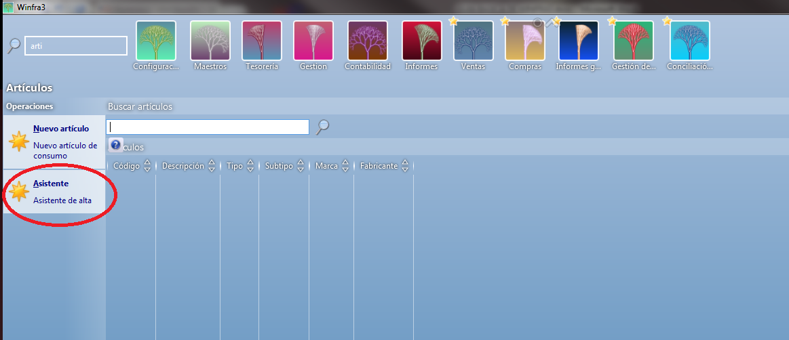

# CREACIÓN DE ARTÍCULOS

Para acceder al menú de artículos escribiremos en el buscador la palabra artículos y nos aparece el menú donde clicaremos en el submenú Artículos.

Una vez dentro vemos a la parte de la izquierda de la pantalla dos operaciones que podemos ejecutar en este apartado pero, como en los clientes, utilizaremos el asistente de alta.

Cuando clicamos en el asistente de alta nos lleva a la pantalla donde vamos a introducir todos los datos necesarios, el sistema nos muestra con un recuadro rojo todos los campos que debemos rellenar obligatoriamente, podemos ver que la pantalla de asistente de alta se divide en tres apartados importantes:

## Artículo consumo

 * Código del artículo: que bien puede ser el que nos propone el sistema, o bien el que nosotros queramos en caso de llevar una codificación diferente para cada artículo.
 * Descripción: el nombre del producto.
 * Fabricante: suele ser el mismo que el proveedor.
 * Tipo: En este apartado indicaremos el tipo de artículo (producto,envase,plv,etc.)
 * Organización de venta: Lo habitual es tener una única organización de venta, pero se puede dar el caso de que haya más de una, en este caso indicaremos la que corresponda (peso, nevera, congelado, etc.)
 * Proveedor: Indicamos el proveedor del artículo.
 * Impuesto: El impuesto que lleva el artículo (21%, 10% o 4%)

## Artículo formato

 * Referencia fabricante: indicaremos la referencia que tiene el proveedor/fabricante para el artículo.
 * Equivalencia: por defecto será 1.
 * Envase: en el caso de que artículo sea retornable le indicaremos el código del envase que va asociado al producto.
 * Valor SIG: si el producto tiene punto verde lo indicamos aqui.

## Artículo almacén

 * Centro de preparación: lo habitual es tener un único centro de preparación, en caso de tener más de uno indicamos el que queremos (picking, peso, etc.)
 * Litros: si queremos que nos muestre los litros los indicamos aquí.
 * Coeficiente de carga: el valor que le damos al producto para optimizar la carga.

Cuando ya tenemos todos los campos clicamos en Guardar.
