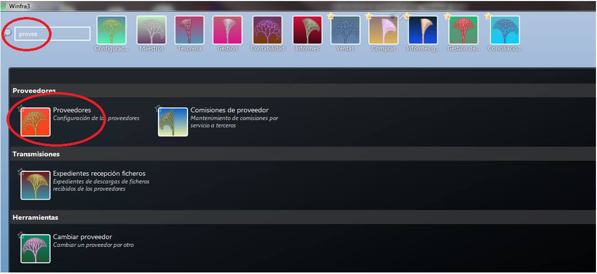
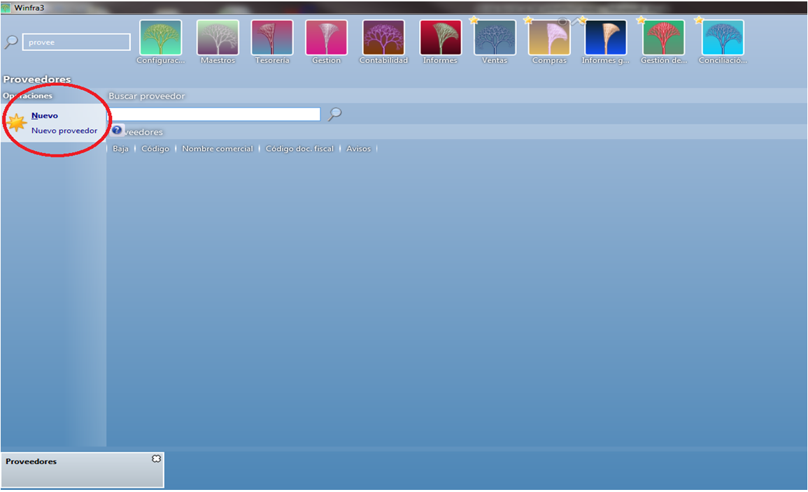
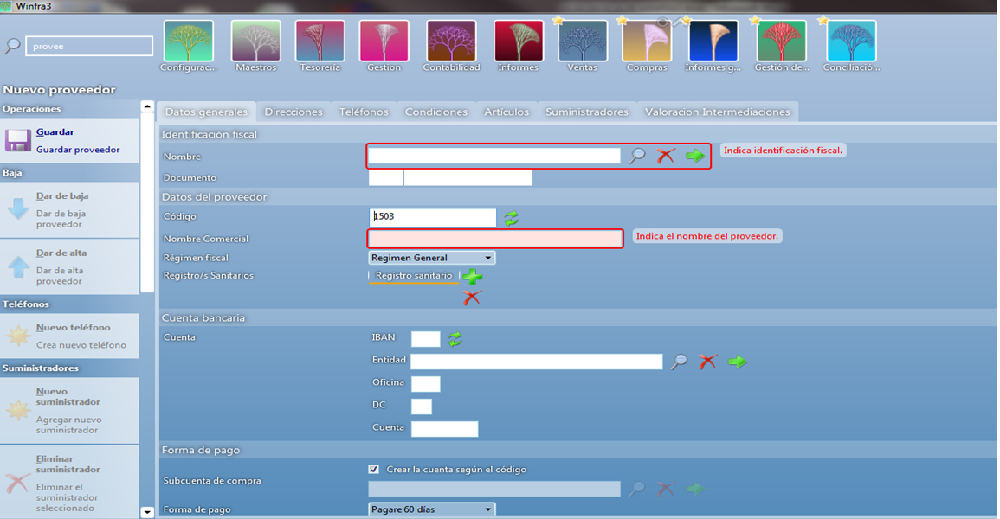
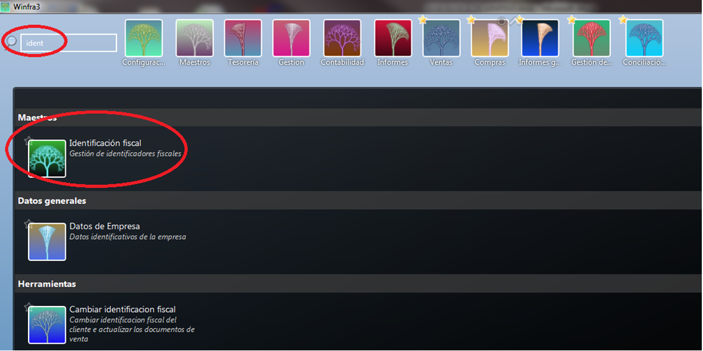
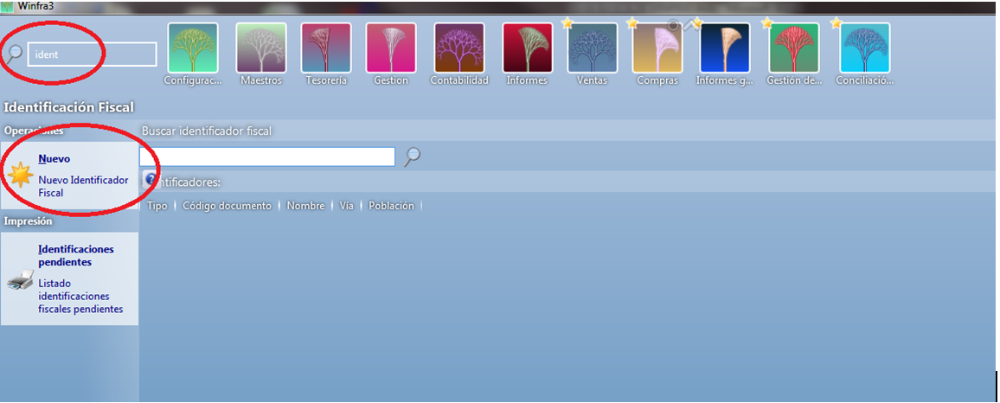
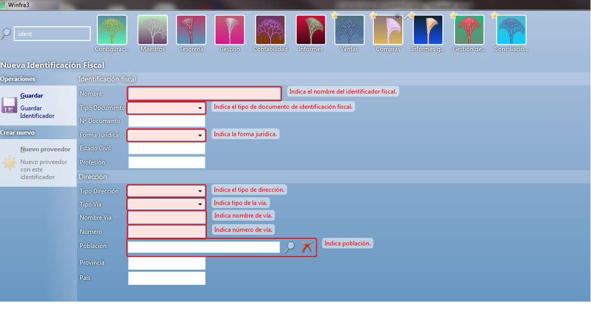
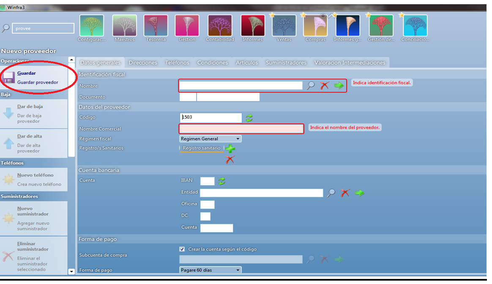

# CREACIÓN DE PROVEEDORES

Para crear o dar de alta un proveedor iremos al maestro y pondremos proveedor.

Una vez dentro vemos en la parte izquierda nos aparece el botón “Nuevo Proveedor”, clicamos ahí y entramos a la ficha para crear el nuevo proveedor.

Como hemos visto tanto en la creación de clientes como en la de artículos los campos remarcados en rojo son campos que debemos rellenar obligatoriamente,

así como en los anteriores apartados nos daba la opción de crear la identificación fiscal en este apartado no nos da esa opción entonces debemos ir primero a Identificación fiscal y crearla allí primero, Guardamos.

