# LIQUIDACION HOJAS DE CARGA

Cuando el vehículo ha terminado su reparto y vuelve al almacén comenzara el proceso de la liquidación.
En el almacén contaran las devoluciones que trae ese vehículo, tanto de envases como de líquido y se apuntará en la hoja de carga para poder introducir esa información en el programa, este paso es el más importante de la liquidación, ya que si no, no nos cuadrara la liquidación.
Cuando este paso este realizado y nos entreguen la hoja de carga (junto con los albaranes de clientes), con las devoluciones empezaremos la liquidación en el programa.
 Iremos a liquidaciones, que como antes podremos acceder a ellas por dos puntos, o bien el icono de liquidaciones o bien introduciendo la palabra en el buscador general.

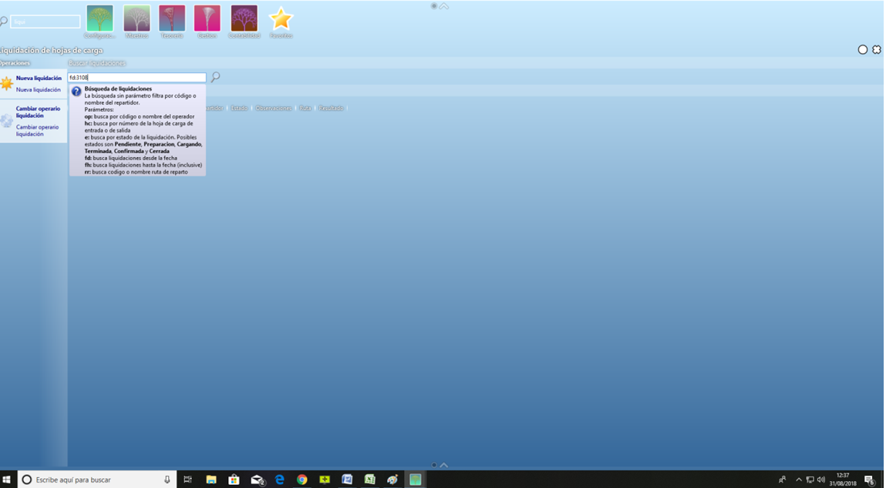

La primera pantalla que nos aparece nos da la opción de buscar alguna 
liquidación anterior, para ello simplemente clicaremos en la lupa y nos abrirá una lista con las liquidaciones tanto ya cerradas como las que están en proceso, esto nos lo indicara en la columna de estado, en caso de que vayamos a comenzar con el proceso sencillamente clicaremos en el botón de Nueva Liquidación.
(Si, desplegamos el interrogante nos muestra todas las opciones de búsqueda. Por fecha fd:  por rr: ruta etc…)

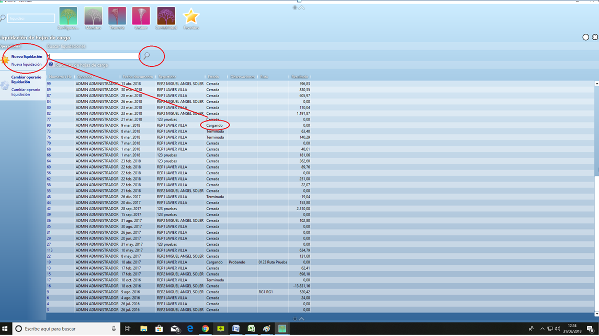

En este caso vamos a realizar una nueva liquidación por lo que clicaremos sobre Nueva liquidación.
Al clicar aquí se nos abre una pantalla para que busquemos  la liquidación con la que queremos trabajar, para ello simplemente le daremos a la lupa para que nos abra la lista de liquidaciones y para seleccionar la que queramos simplemente nos posicionaremos sobre ella y le daremos doble clic:

Al seleccionar la liquidación (con doble clic o seleccionando y dando a aceptar) nos aparecerá un cuadro de dialogo indicándonos que se van a generar hojas de entrada, le daremos a aceptar:

Esto nos lleva a la pantalla principal de la liquidación, donde se nos posicionara en la pestaña de Datos Generales, aquí observaremos que en operador sale la persona que esta logeada en ese momento en la aplicación, también nos da el nombre de la persona que ha repartido el género, si no tenemos automatizado el almacén deberemos primeramente introducir todo lo que ha descargado el vehículo en nuestro almacén, tanto envases como liquido, para ello clicaremos sobre el botón del numero de Hoja de Carga de entrada:

Al clicar ese botón nos aparecerá una pantalla donde primeramente nos mostrara los datos generales del reparto, es decir, el nombre del repartidor, los datos del vehículo que ha realizado el reparto, el almacén donde ha entrado el género devuelto, etc.

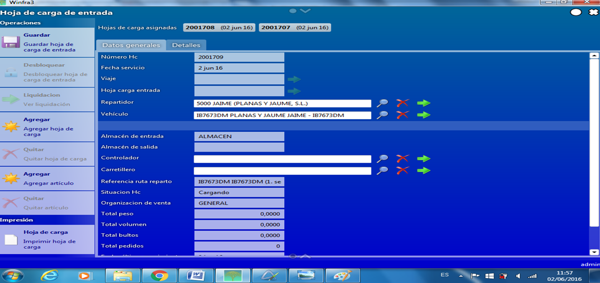

Nos dirigiremos a la pestaña de detalles y aquí introduciremos todo lo que se ha devuelto, si fuera liquido directamente en la línea del producto, introduciríamos la cantidad devuelta en la columna de entrada si simplemente es devolución porque el cliente no quiere el género, si es porque el género esta en mal estado lo pondríamos tanto en la columna de entrada como en la columna de mal estado y si fuera por rotura también en la de entrada y en la de rotura, si fueran envases hay dos posibilidades, que ya tengamos una línea de envases porque los artículos ya lleven enlazado automáticamente el envase con lo que simplemente nos posicionaríamos en la línea y en la columna de entrada pondríamos la cantidad que devuelven o que sea un envase de un producto que no se haya servido pero que el cliente nos devuelve igualmente envases, en el segundo caso nos dirigiríamos al botón que nos aparece en la izquierda de agregar Articulo y al clicar sobre el nos aparece una línea para que introduzcamos el producto:

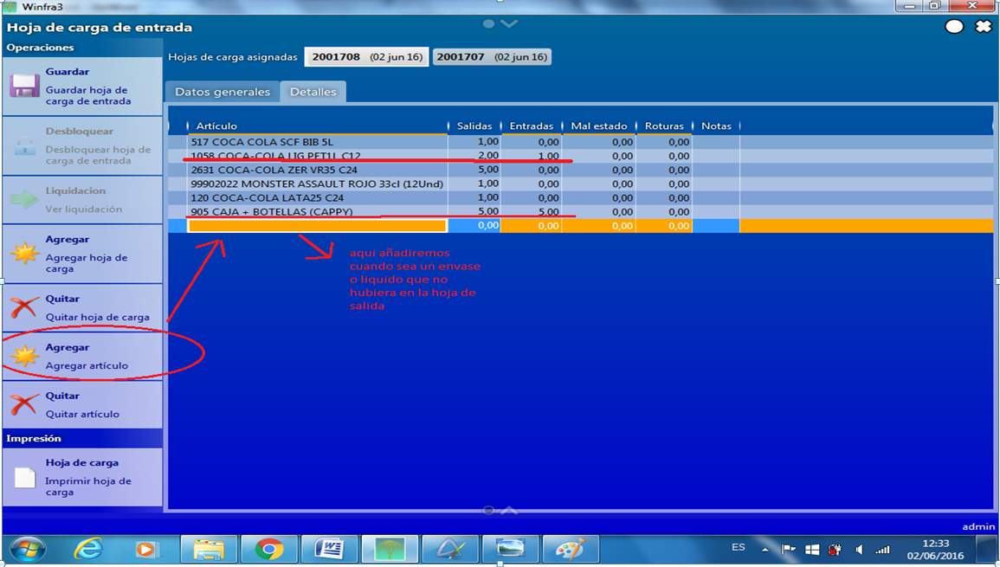

Una vez introducidas  todas las devoluciones clicaremos sobre el botón de Guardar  para que el sistema registre los datos introducidos:

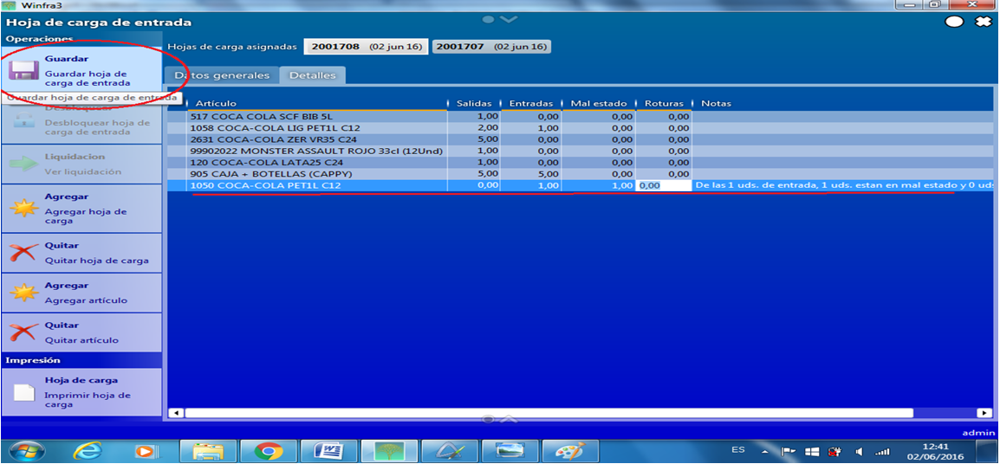

A continuación vamos a rectificar  los albaranes  con los cambios que hemos realizado, es decir, abonaremos o cargaremos envases o líquido en caso de tener que hacerlo, para ello en la pantalla inicial de la liquidación nos dirigiremos a la pestaña de Documentos, donde nos aparecerán los albaranes de esa hoja de retorno:

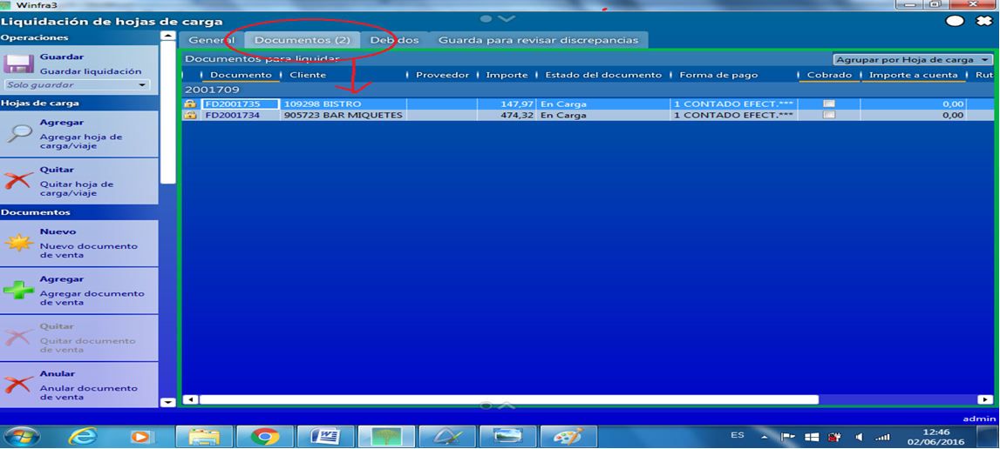

En la parte superior derecha tenemos un desplegable que nos permite seleccionar la forma en que queremos ver los documentos: 

 * ** Sin agrupar:** salen los documentos sin indicarnos a que hoja de carga pertenecen.

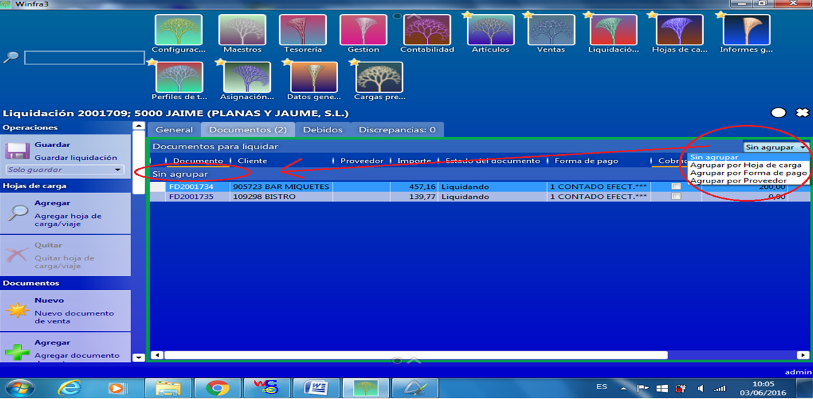

 * ** Agrupar por hoja de carga:** nos salen los documentos agrupados por hojas de carga y en la barra nos indica el numero de la hoja de carga.

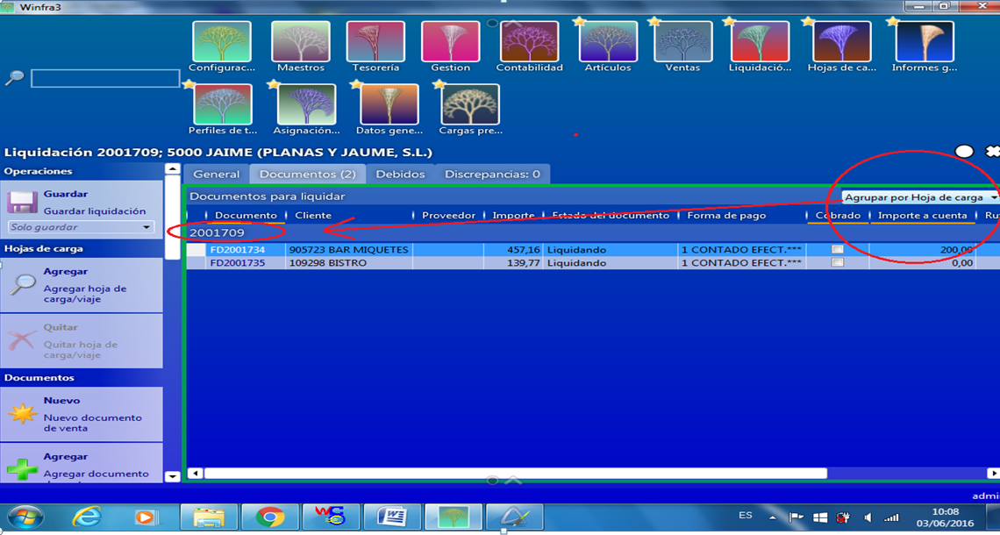

 * **Agrupar por forma de pago:** nos muestra los documentos agrupados según su forma de pago.

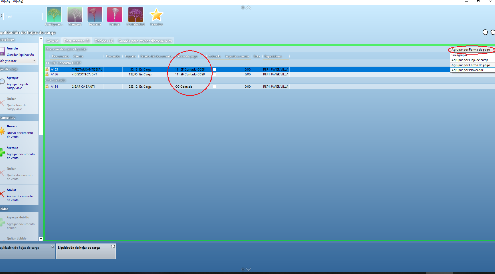

 * ** Agrupar por proveedor:** realmente este campo nos sirve para los albaranes de intermediación, porque nos separara los albaranes de venta propia, que aparecerán los primeros, de los que son de intermediación, que vendrán a continuación, en este caso tampoco nos aparecera el numero de la hoja de carga.

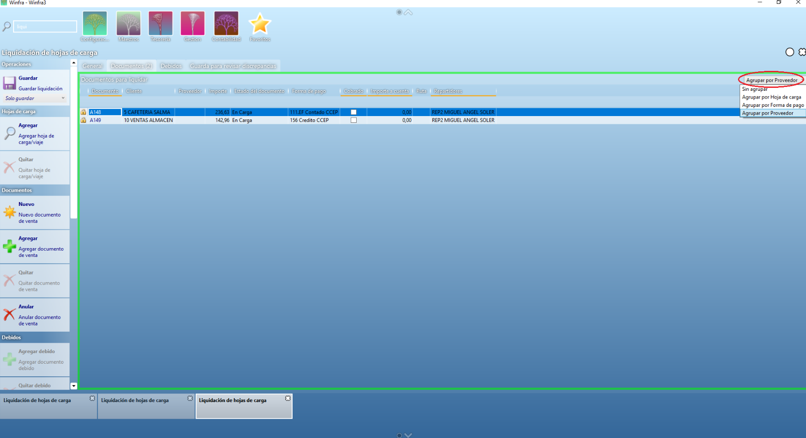

Para abrir un documento haremos doble clic en este y se nos abrirá, le daremos a agregar detalle para poder introducir los productos devueltos, tanto envases como liquido:

Esto nos abrirá una pantalla donde clicaremos sobre procesar e iremos después añadiendo los artículos (como en el caso de antes si no conocemos el código simplemente introduciremos una palabra de la descripción y lo buscaremos en la lista que nos saldrá al clicar Intro):

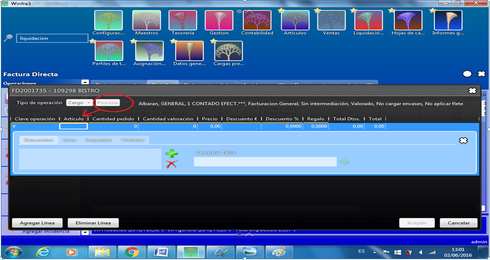

Las devoluciones siempre las introduciremos en negativo, para seguir agregando artículos simplemente después de introducir los datos clicaremos en Agregar Línea para que nos de una nueva línea vacía para añadir el siguiente artículo, una vez finalizado le daremos a aceptar.

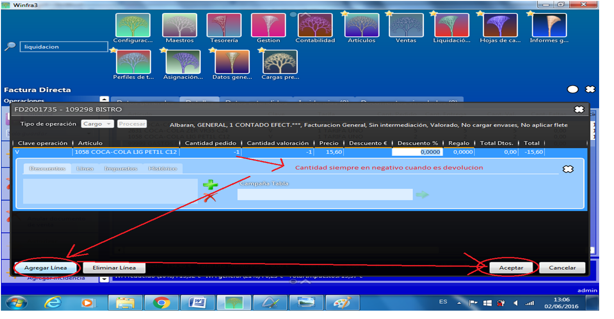

Si nos equivocamos en una línea y queremos quitarla, simplemente estando sobre ella clicaremos en el botón de Eliminar Línea

Una vez realizados todos los cambios le daremos a Aceptar para que nos acepte todas las líneas y después a cancelar para salir de la pantalla:

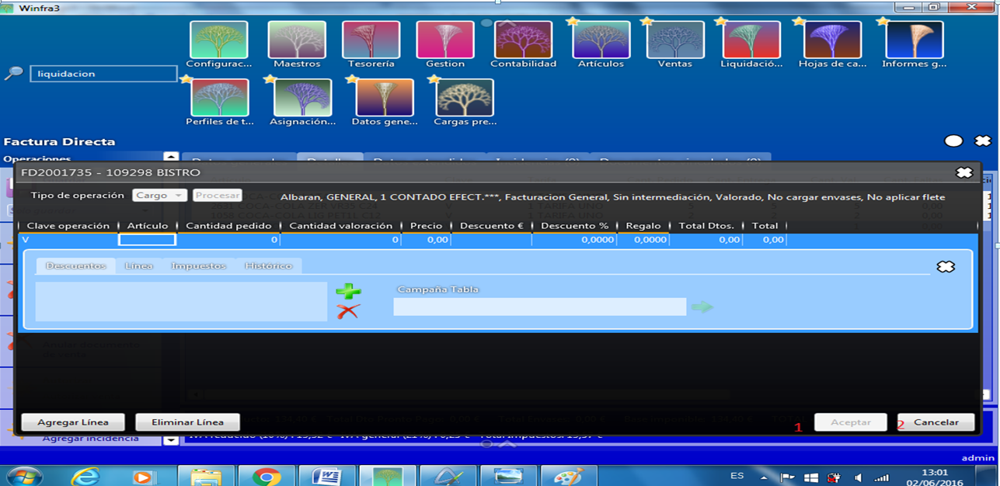

Nos llevara al detalle del albarán donde procederemos a clicar a Guardar (es importante guardar siempre antes de salir de cualquier pantalla, el seleccionar varias veces guardar no altera nada y es preferible guardar aunque no sea necesario que salir si hacerlo y que en ocasiones podamos perder la información introducida) y después nos saldremos del albarán clicando sobre la cruz superior derecha:

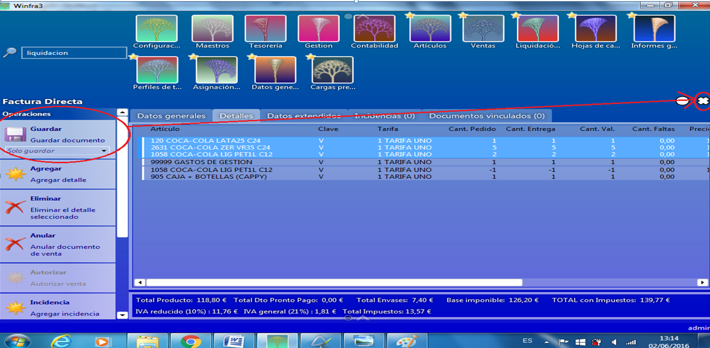

Una vez modificados los albaranes necesarios, clicaremos sobre Guardar Liquidación para así poder revisar las discrepancias, en el caso de que las hubiera:

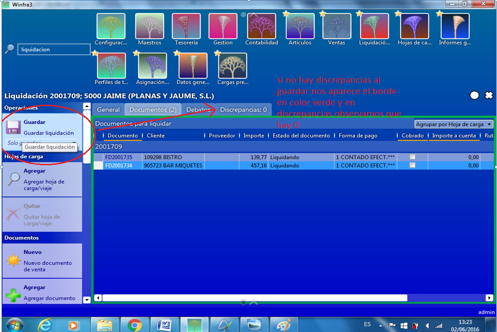

En caso de que hubiera discrepancias el borde aparecería en rojo y nos indicaría la cantidad que hay en las pestaña de discrepancias:

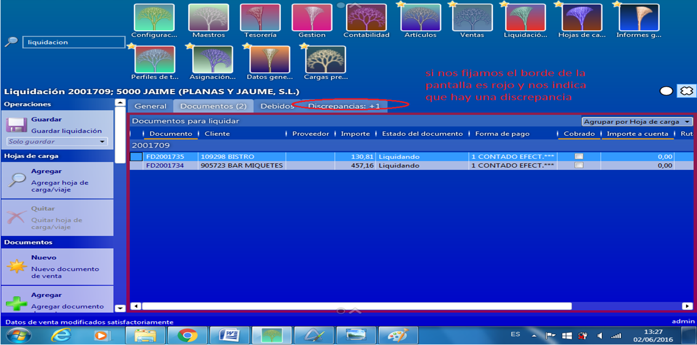

 Clicaremos sobre la pestaña de discrepancias y nos abrirá una pantalla donde podremos visualizar el artículo o artículos que discrepan y los movimientos de estos:

 En este caso nos está indicando que han salido 5 envases pero que solo nos han devuelto 4, tendremos que averiguar si le ha faltado al repartidor ese envase o nosotros nos hemos olvidado de introducir esa devolución o cargo en caso de que realmente el cliente solo nos haya devuelto 4, con lo que deberíamos revisar los albaranes y si es el caso añadirlo como devolución/cargo.
En el caso del ejemplo nuestro, vemos que el problema es que un cliente tiene 5 envases de salida pero solo ha devuelto 4, con lo que se le debe de cobrar 1 envase, para realizarle el cobro procederemos a irnos al apartado donde nos aparecen los albaranes en la hoja de retorno (a través de la pestaña de documentos), seleccionaremos el albarán a modificar clicando 2 veces sobre él para que se nos abra, luego a Agregar detalle para introducir el envase, que en este caso es en positivo ya que se le va a cobrar:

Una vez añadida la línea, procederemos como en el caso anterior a darle a aceptar y después a cancelar para salir de la pantalla, esto nos llevara de nuevo al detalle del albarán donde le daremos a guardar y después cerraremos la pantalla desde la cruz superior de la derecha:

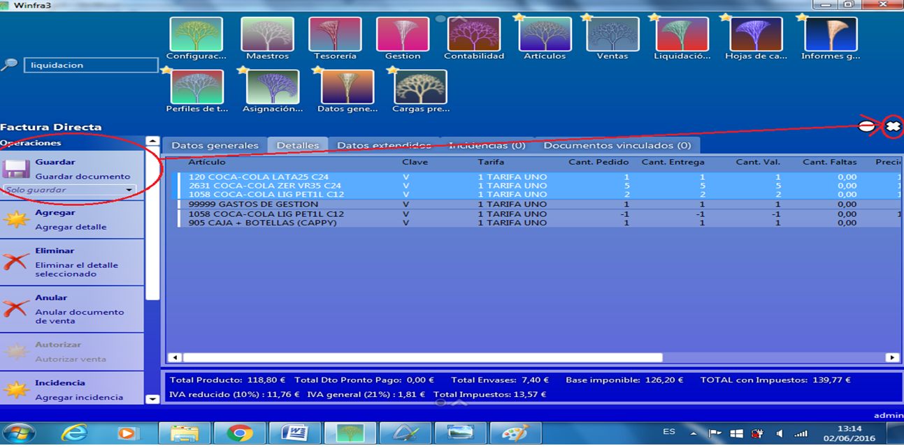

En ese momento observaremos como está actualizando y ya nos debe de salir las discrepancias a cero y el borde en verde si hemos realizado todo de manera correcta:

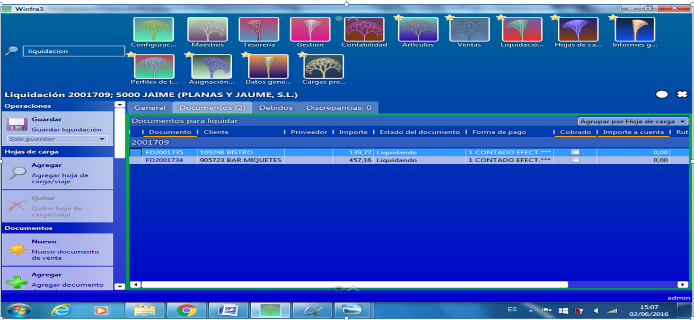

Después de esto procederíamos a plasmar los cobros realizados por el repartidor, para ello nos fijaremos que en la línea de los albaranes hay dos columnas, una llamada Cobrado y la otra Importe a Cuenta, de normal la casilla de cobrado no vendrá marcada, por lo que tendremos que marcarla haciendo doble clic sobre ella en los albaranes que nos hayan abonado, esta casilla solo se marca en caso de que abonen la totalidad del importe del albarán, (si por el contrario vienen todas marcadas, seria al revés, es decir, desmarcaríamos los albaranes que no se han cobrado), la columna de importe a cuenta solo la rellenaremos en caso de que el cliente no haya pagado la totalidad del albarán, pero haya dado una cantidad a cuenta de ese albarán, en este caso solo pondríamos el importe entregado en esta columna pero no marcaríamos la columna de Cobrado ya que no nos ha abonado la totalidad del albarán, por ejemplo, en el caso que estamos viendo, imaginemos que solo nos paga algo a cuenta el Bar Miquetes, que nos entrega 200 euros a cuenta del albarán, así debería de quedar en la liquidación:

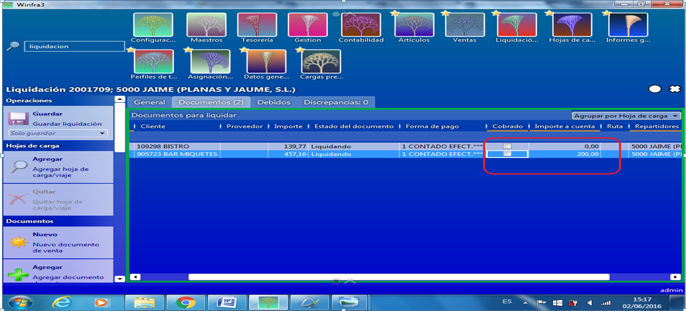

Una vez introducidos los cobros de los albaranes, como siempre, le daremos a Guardar.
A partir de aquí llega el cierre de la liquidación, y hay dos posibilidades:
1.- Que en nuestra empresa la persona/s encargada de realizar las liquidaciones sea también la responsable de contar el dinero, en ese caso, al ir a cerrar la liquidación, nos saldría un cuadro de dialogo dándonos la posibilidad de crear la tesorería para esos cobros:

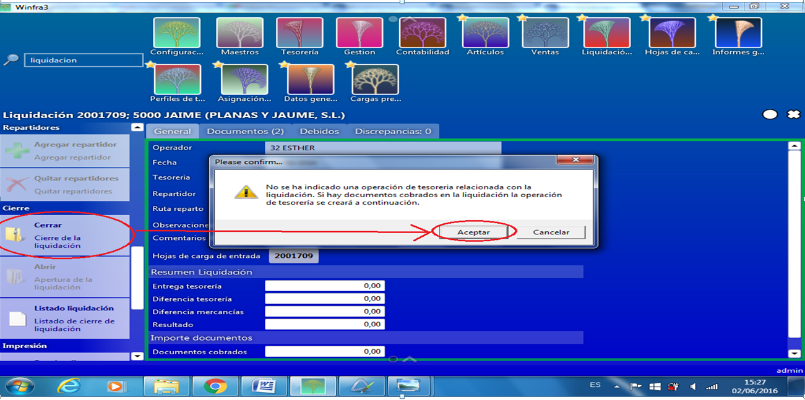

Al darle a Aceptar se nos cierra la liquidación y nos deberemos de dirigir a la pestaña General, donde podremos observar que se nos ha creado ya la tesorería para ese repartidor, entonces clicaremos sobre la flecha verde que sale al lado del nombre del mismo y nos dirigirá al movimiento de tesorería que se nos ha creado:

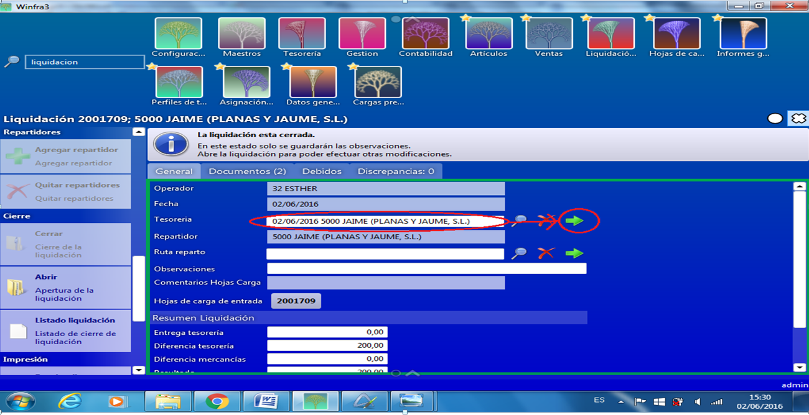

En esta nueva pantalla de tesorería podremos especificar como se ha realizado el cobro, en efectivo, talón, ingreso a banco (si el repartidor al ser una cantidad importante la haya ingresado en la cuenta de la empresa para no llevar tanto efectivo encima), para ello dependiendo de cómo se haya efectuado el cobro nos dirigiremos a la pestaña correspondiente, puede ocurrir que tengamos que usar más de una de las formas de cobro, porque un cobro puede efectuarse de varias formas a la vez, en la liquidación solo pondremos el total de lo cobrado en el albarán pero aquí ya especificaremos de qué forma ha sido cobrado:

* ** Efectivo: ** Por defecto siempre nos pasará todo como efectivo así que si no fuera así tendríamos que poner a cero esta columna o la parte de efectivo que nos hubieran dado, en caso de que nos haya pagado solo parte en efectivo el cliente.

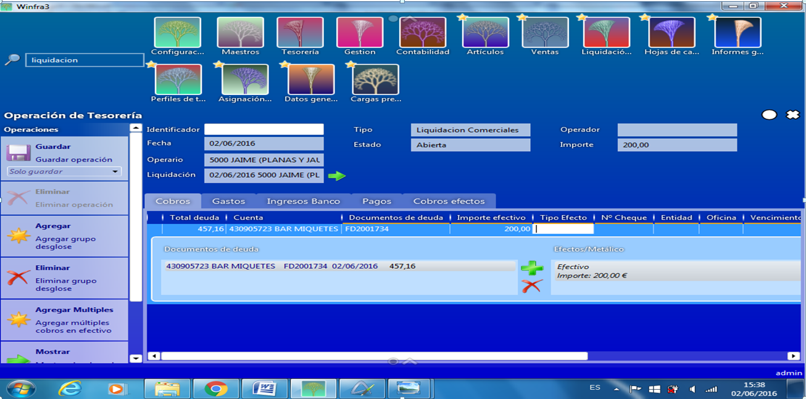

* **Talón: ** Nos posicionaremos en la columna de tipo de efecto y si no sabemos los que hay registrados, pondremos un asterisco y clicaremos intro y esto nos sacara un cuadro con los diferentes tipos de efectos.

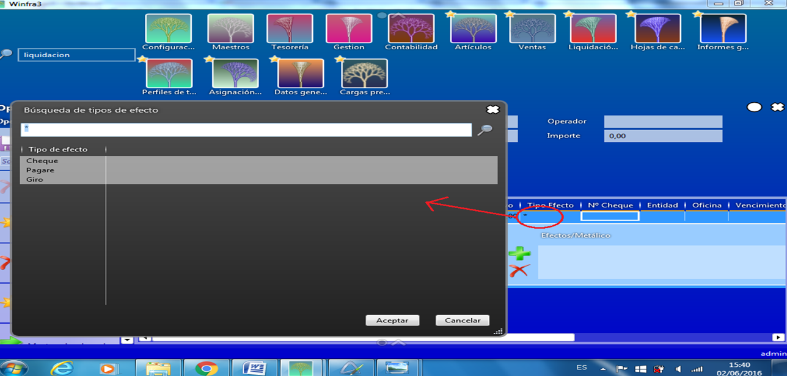

después de especificar el tipo de efecto simplemente rellenaremos los datos del cheque (numero, oficina, entidad, fecha vto. e importe)

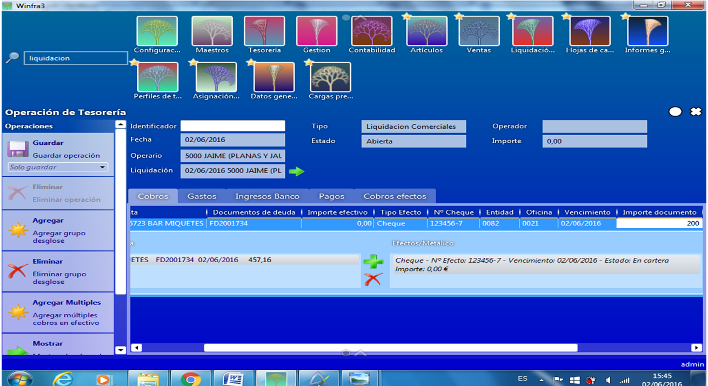

* ** Ingreso Banco: ** En este caso pondríamos igualmente el importe cobrado en la pestaña de Cobros y luego en la pestaña de ingresos en Banco indicaremos la cuenta de tesorería (el banco donde se ha hecho el ingreso) en descripción contable algo que nos indique de donde viene ese ingreso y la fecha (por ejemplo, ingreso Jaime Planas, que es el repartidor en este caso) y en tercer lugar el importe ingresado.

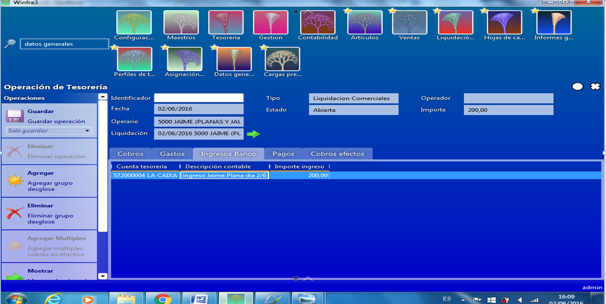

Puede ocurrir que si le pagamos dietas al repartidor este nos traiga el ticket de la dieta y nos falte ese importe del efectivo, con lo que tendríamos que reflejar ese importe en la pestaña de Gastos, si no sabemos el tipo de gasto que es pondremos en el campo un asterisco y nos saldrá un desplegable con los tipos de gastos posibles y simplemente seleccionaremos el que nos interese:

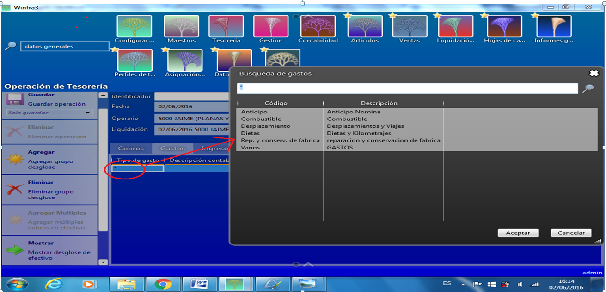

Si seleccionaríamos la opción de Dietas o Combustible, directamente nos lo asociaría con la cuenta de gasto creada para la empresa, ya que se supone que ese gasto lo asume la empresa, nosotros rellenaríamos los campos de descripción contable, donde pondríamos el gasto y la persona que lo ha hecho y la columna de la cantidad de dinero:

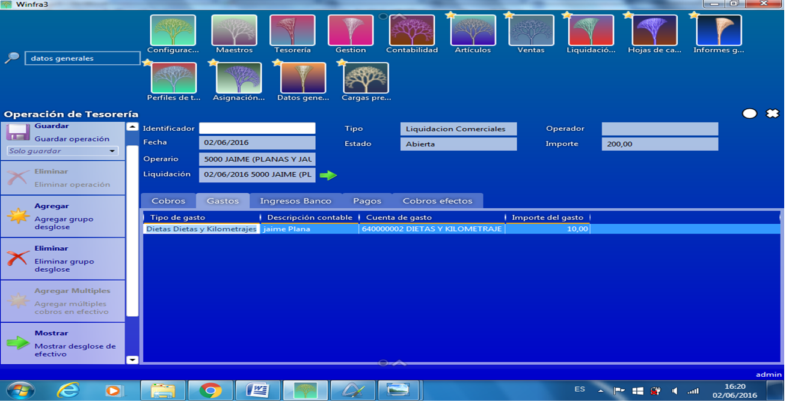

Una vez terminados estos pasos gardaremos toda la información, después, si hay efectivo  procederemos a realizar el desglose del mismo, dirigiéndonos  al botón lateral Mostrar desglose de Efectivo.

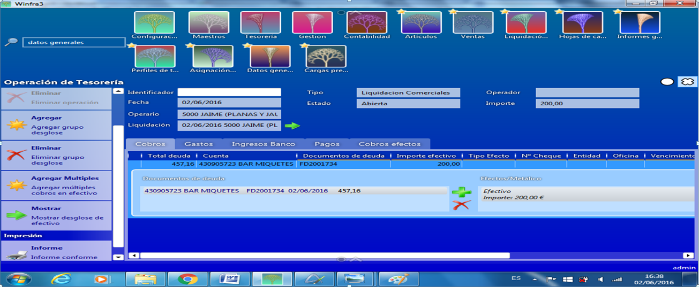

Y aquí introduciré todo el efectivo o bien desglosado por tipo de moneda o todo en un solo campo.
Lo primero que debo de verificar es que en Operario esta el nombre del repartidor/comercial, en el campo de Valor de Cuadre pondré el importe total que me ha entregado, y después podre desglosar las monedas en el cuadro de Desglose o directamente poner el total en el Cuadre de entregas en el campo de Efectivo (los cheques, ingresos en cuenta no hay que contarlos porque al introducirlos ya los contabiliza el programa directamente y te los muestra en el cuadre de entregas….) 
Si todo está perfecto no nos saldrá ninguna diferencia en el Cuadre Liquidación:

En caso de que faltara algo de efectivo al cerrar la Tesorería nos aparecería una diferencia que automáticamente el programa lo pasa a la cuenta contable del Operario responsable.

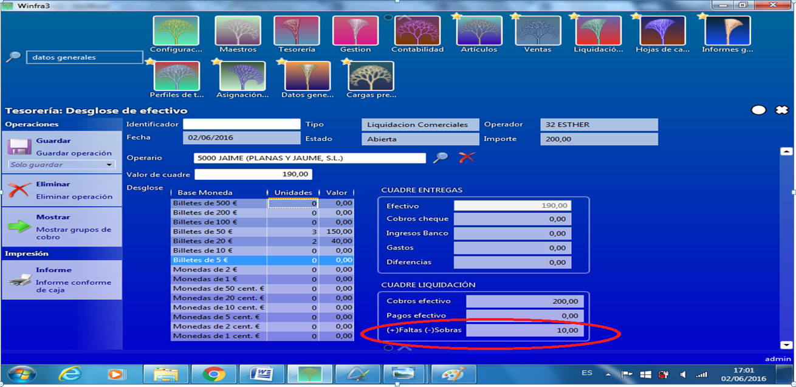

2.- si en nuestra empresa existe un departamento independiente de caja para contar el dinero que entregan los repartidores/comerciales ( para ver como se crea la tesorería fuera de una liquidación revisaremos el siguiente apartado de este manual, llamado Tesorería para Cobros), en cuyo caso después del último paso de guardar, nos dirijamos a la pestaña de datos generales y busquemos en la tesorería a la persona que ha entregado el dinero (en el caso de liquidaciones siempre serian repartidores) y simplemente tendremos que asociar esa tesorería a la liquidación.
