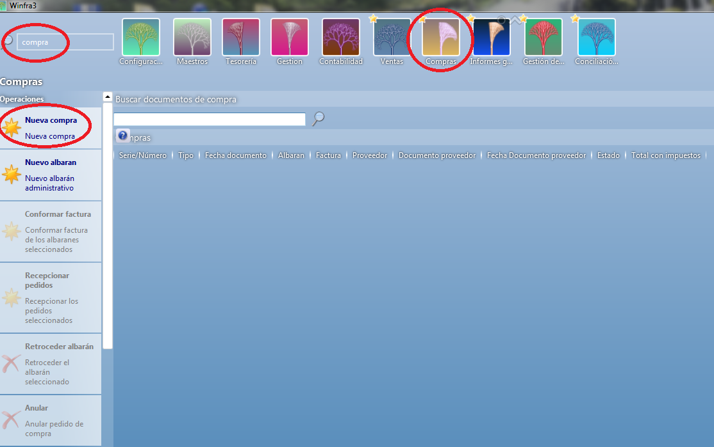
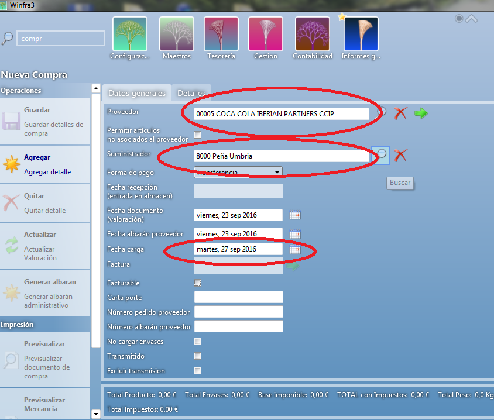
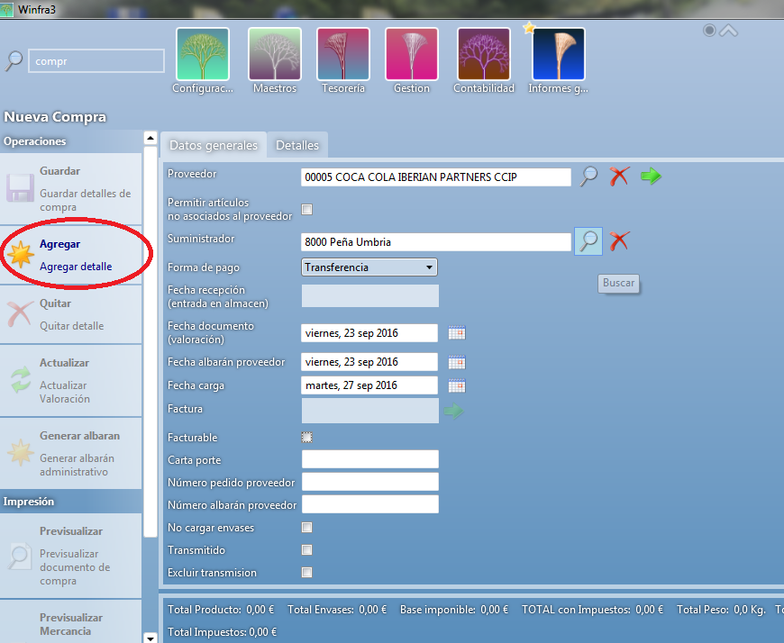
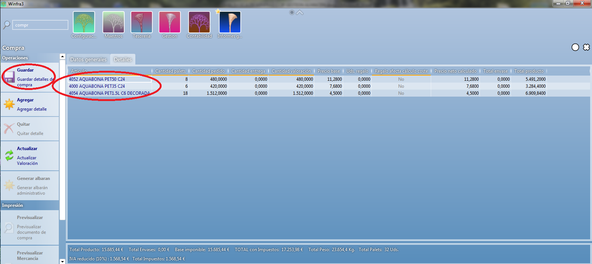
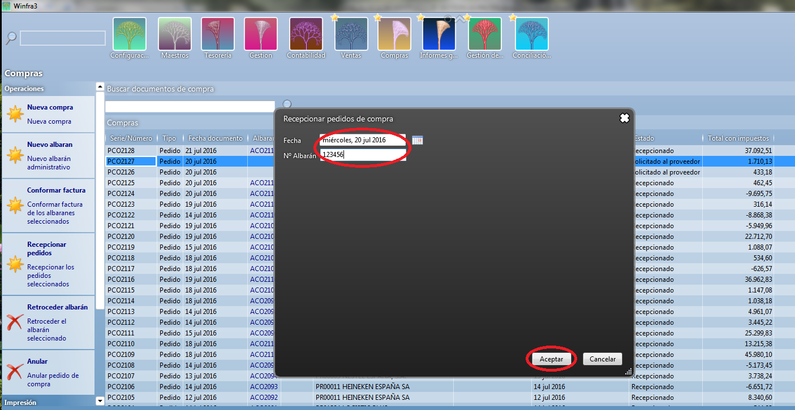
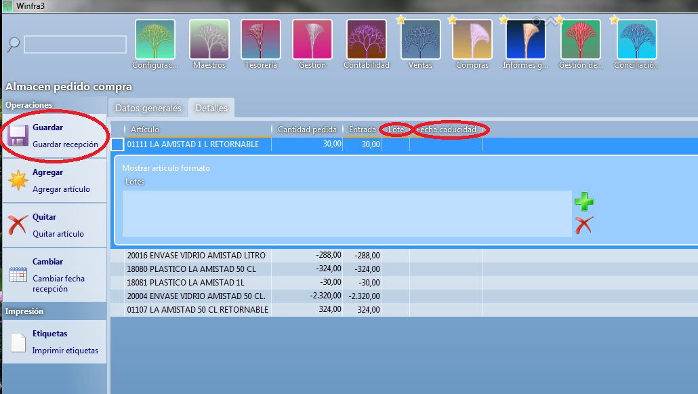
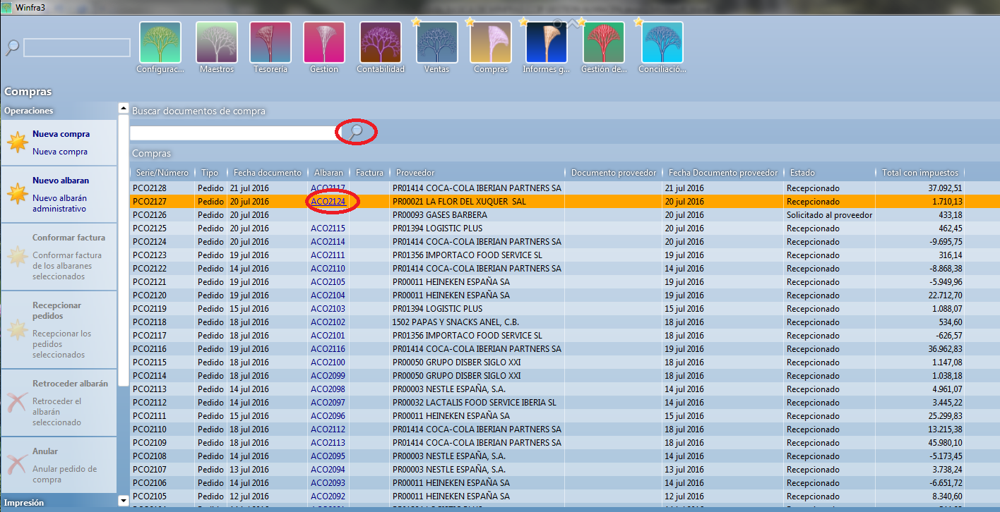
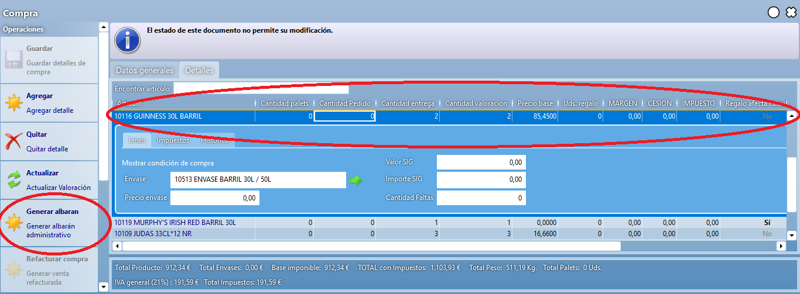
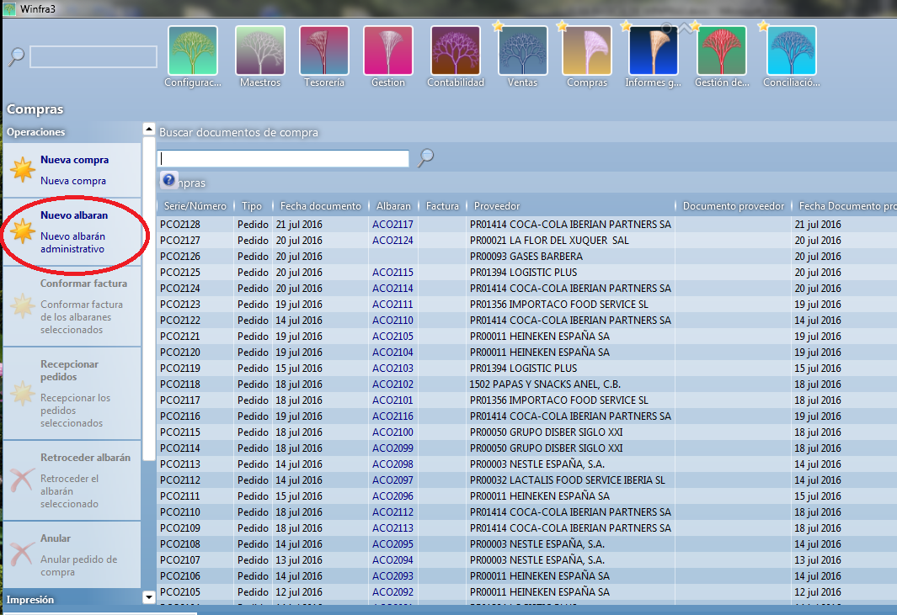
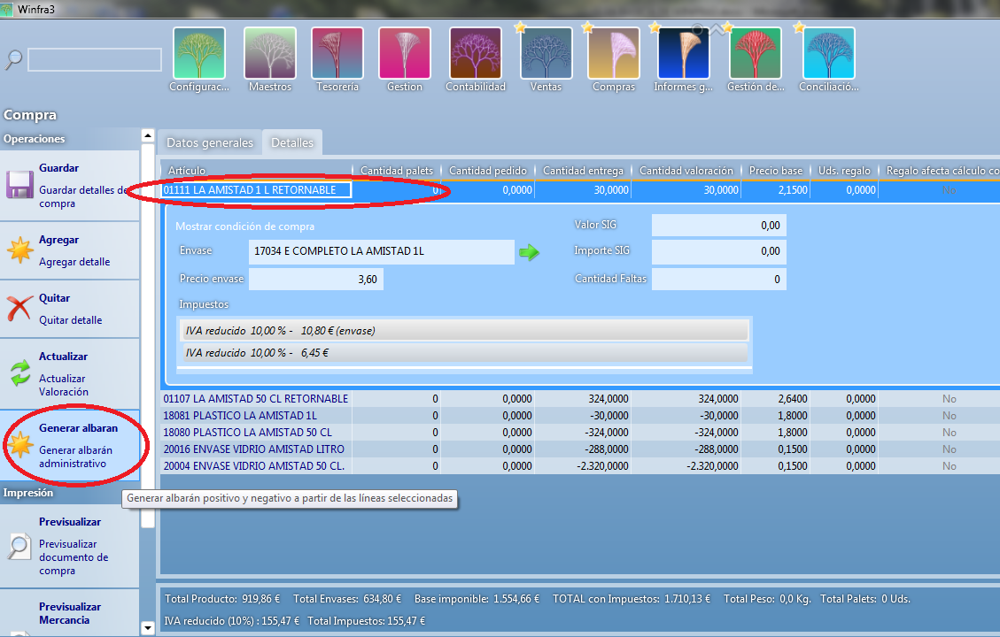

# PEDIDOS DE COMPRA

Para realizar los pedidos de compra entraremos en Compras y pincharemos sobre Nueva Compra:

Una vez dentro nos aparece la pestaña de datos generales, ahí pondremos el proveedor al cual le vamos a realizar el pedido, si dicho proveedor tiene varios almacenes de suministro en el apartado Suministrador deberemos poner el que corresponda, también debemos especificar la fecha de carga, puesto que hay almacenes con condiciones de carga o con mínimo de días de entrega, cuando ya tenemos todos los datos generales introducidos le damos a Agregar Detalle:

Esto nos lleva a la pestaña de detalles, ahí empezaremos a introducir los artículos que vamos a solicitar al proveedor, cuando hemos terminado de poner todos los artículos le daremos a Guardar:

Esto nos genera un pedido con una serie PCO??? que nos permitirá localizarlo cuando recibamos la carga en nuestro almacén, para poder confirmar la recepción de dicho pedido, cuando nos llegue la mercancía nos posicionaremos en el PCO correspondiente y marcaremos la línea, en ese momento se nos marcarán los botones de la parte izquierda de la pantalla, ahí nos aparece “Recepcionar pedidos” pinchamos encima y esto nos muestra un cuadro de texto donde nos aparece la fecha de recepción y el número de albarán que tendremos que poner el que nos da el proveedor.

Una vez hecho esto nos aparece una pantalla en la cual pondremos el lote de cada producto y la fecha de caducidad, y le damos a Aceptar. Esto nos crea un albarán “ACO”.

Tenemos la opción de importar los lotes mediante un fichero enviado por el fabricante, esto solo estaría disponible en el caso de que el fabricante nos enviase el fichero con los datos.

Cuando ya hemos guardado los lotes volveremos a la pantalla de compras donde se nos van guardando todos los pedidos de compra que vamos realizando, le daremos a la lupa y esto nos actualizará el listado, mostrándonos entonces el número de albarán.

Una vez terminado este proceso y cuando el proveedor nos envíe la factura procederemos a comprobarla, si encontramos alguna diferencia entre la factura y el albarán deberemos, entrar en el ACO y seleccionando la línea del producto que está erróneo, clicamos sobre el botón a la parte de la izquierda sobre "Albarán Administrativo", este albarán nos permite llevar un control de las diferencias que podamos tener en la factura, si nos han facturado cajas de más. Este proceso nos creará dos documentos: uno en positivo y otro en negativo para poder adjuntarle según convenga a la factura correspondiente.

En el caso de que algún producto que está en el albarán inicial haríamos lo siguiente, entraremos en el albarán en el cual está el error y pinchando sobre la línea del producto que no hemos recibido y en la parte izquierda de la pantalla le daremos a Generar albarán Administrativo.

