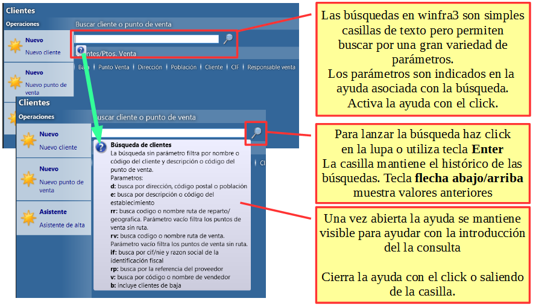

# Búsquedas



## Búsqueda de texto y códigos

 * Cada búsqueda define que busca sin utilizar ningún parámetro.
 * En caso de texto busca su cualquier ocurrencia. Para buscar valor exacto incluye el texto entre comillas dobles **"**.
Puede utilizar el comodín \* (asterisco) dentro de las comillas.
 * En caso de código busca el valor exacto.
 * Para evitar la búsqueda exacta del código utilice comodín \* (asterisco)
 * La búsqueda no distingue mayúsculas y minúsculas, pero sí distingue los acentos.

Ejemplo de la búsqueda de clientes. Búsqueda de clientes busca por defecto el código o descripción de cliente:

```
hotel
```

encuentra todos los hoteles (por su descripción)

```
bar juan
```

encuentra todos los Bar Juan y ademas Bar Juanjo y Cafetería bar Juan.

```
"bar juan"
```

encuentra solo el nombre exacto, incluso teniendo en cuanta los espacios

```
"bar juan*"
```

encuentra Bar Juan y Bar Juanjo pero no la Cafetería bar Juan

```
100
```

encuentra solo cliente con el código 100

```
100*
```

encuentra cliente 100, 1001, 1002 etc., pero también las franquicias de '100 Montaditos'

En la búsqueda de artículos:

```
barril*50
```

encuentra tanto 'Barril AMSTEL 50L' como 'Barril 50L Heineken'

## Búsqueda con parámetros

Los parámetros son normalmente una o dos letras separadas por **:** (dos puntos).
Un separador alternativo es configurable en la [configuración de la aplicación](../views/Ribera2.Shell.Views.ThemeConfigView).

Después de **:** va normalmente el texto o código buscado o el parámetro se puede quedar vacío.
Al texto buscado se aplican las mismas reglas de uso de \* y de **"** mencionados en apartado anterior.

Se aplican las siguiente reglas:
 * Se permite cualquier combinación y orden de parámetros
 * Múltiples parámetros se separan con un espacio
 * Todos los parámetros se aplican al mismo tiempo
 * Para añadir un valor sin parámetro después de otros parámetros utiliza solo **:**

Ejemplo de búsqueda de con parámetro:

```
hotel d:valencia
```

busca todos los hoteles en Valencia

```
d:valencia :hotel
```

es equivalente al anterior. La búsqueda sin parámetro no necesita : si esta en primera posición

```
hotel d:valencia b:
```

busca todos hoteles en Valencia incluyendo los marcados de baja

```
rr:10
```

busca todos los clientes de la ruta 10

```
rr:
```

busca todos los clientes sin ruta

## Búsqueda de la dirección

La búsqueda de dirección permite buscar por la calle, población y código postal. Separa la calle y población por coma.

```
d:46680
```

busca el código postal exactamente

```
d:mayor
```

busca por calle o población. Encuentra todas las plazas mayor y también Villamayor.

```
d:mayor, villamayor
```

encuentra solo la plaza mayor de Villamayor.

En caso que hay mas pueblos con el mismo nombre utiliza el código postal:

```
d:mayor, 46680
```

Para buscar solo el pueblo sin tener que utilizar el código postal utiliza el asterisco:

```
d:*, mayor
```

encuentra todas las calles de Villamayor.

## Búsqueda por fecha

típicos parámetros para las fechas son fd: y fh: para fecha desde y fecha hasta.
La fecha hasta esta incluida en la búsqueda.

La fecha puede estar representada de siguiente manera:
 * **0** – hoy ej.: “fd:0”
 * **10** – día diez del mes actual:

```
fd:01 fh:31
```

incluye todo el mes actual, funciona aunque el mes actual tenga 30 días

 * **1005** – 10 de mayo de este año
 * **100515** – 10 de mayo 2015
 * **10052015** – 10 de mayo 2015

 * **+3** – en tres días
 * **-1** – ayer – suma o resta los días de la fecha de hoy
 * **x** – miércoles de semana actual (las letras de los días son **lmxjvsd**)
 * **xx** – miércoles de la semana que viene etc.:

```
fd:l fh:vv
```

desde lunes de esta semana hasta viernes de la semana que viene.

 * **-x** – miércoles de la semana pasada

Indicar solo fd o fh selecciona solo ese día. Utiliza \* (asterisco) con una fecha para indicar el intervalo abierto sin indicar la otra fecha:

```
fd:01*
```

incluye todo desde día uno

```
fh:-v*
```

incluye todo hasta viernes pasado
