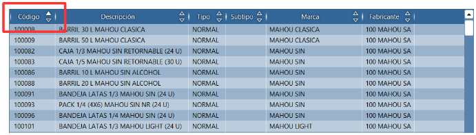
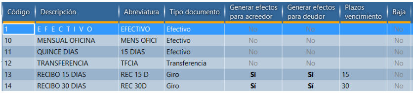
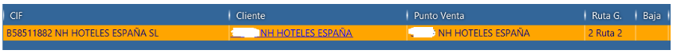

# Cuadrículas de datos

Cuadrículas son el principal método de visualización y modificación de datos.

## Cuadrícula de visualización

 * Es solo de lectura y carga solo los registros que el usuario esta viendo.
 * Las flechas indican la ordenación actual de la cuadricula. Es posible ordenar por varias columnas a la vez.
La ordenación se aplica a todos los resultados, no solo los que están visibles en la cuadricula.
 * La barra vertical permite cambiar el tamaño de la columna.
 * Arrastrar la columna permite cambiar el orden las columnas.
 * Double-click o tecla Entrar activan el registro
 * Utiliza teclas Mayúscula y CTRL para selección múltiple de los registros

## Cuadrícula de modificación

 * Permite modificación de los datos directamente en la línea seleccionada.
 * Las columnas modificable tienen la cabecera subrayada en color naranja.
 * La ordenación de la cuadrícula permite ordenar solo por una columna y solo ordena datos que ya están en la cuadrícula.

Teclas de modificación:
 * Utiliza flechas para seleccionar la casilla
 * Para editar la casilla simplemente empieza escribir
 * Para vaciar la casilla aprieta tecla **Retroceso**
 * Para cancelar la modificación utiliza tecla **ESC**
 * Para confirmar el valor utiliza **Enter** o **Tab** o **tecla +** del teclado numérico.

 !! Confirmar el registro con **Enter** pasa a siguiente registro. Confirmar con el **Tab** o **+** pasa a siguiente columna.

## Cuadrícula con vínculos

El ejemplo de la búsqueda del cliente presenta registro con vínculos a información relacionada:
 * identificación fiscal
 * datos de cliente
 * datos de punto de venta
 * ruta de reparto

Click sobre el vínculo abre la pantalla correspondiente. Para editar el valor utiliza las teclas o haz click dentro de la casilla pero fuera del texto.
