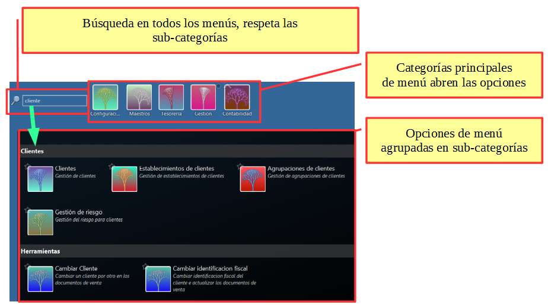
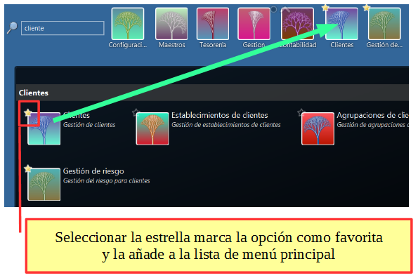
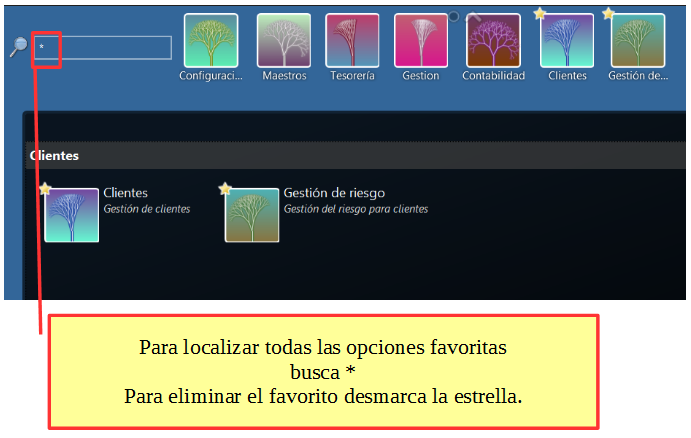

# Menú principal

## Composición de menú y búsqueda



## Configurar favoritos dentro del menú



## Buscar y eliminar favoritos del menú



```{note}
Los favoritos pueden aparecer al final del menú principal o incluidos dentro de un submenú.
```
 La opción esta configurable en la pantalla [](../views/Ribera2.Shell.Views.ThemeConfigView).
 La misma pantalla permite también eliminar todos los favoritos a la vez.
